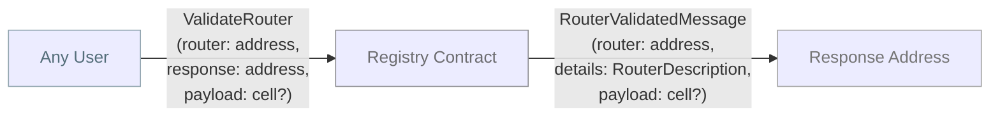
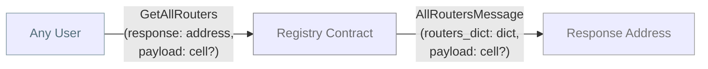
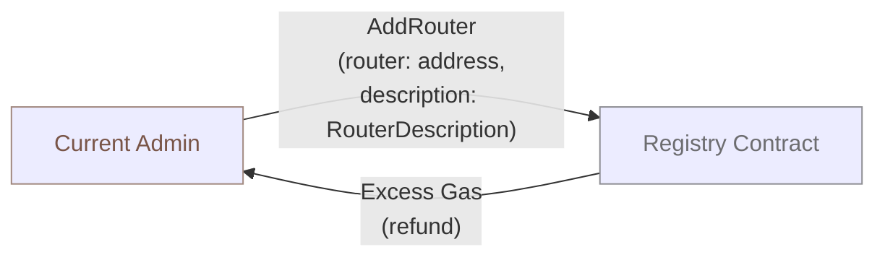
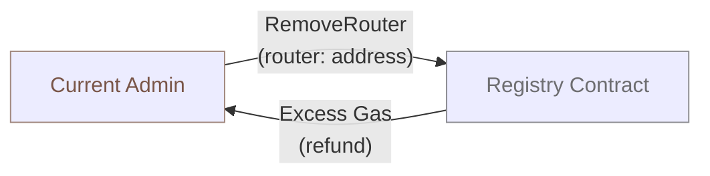
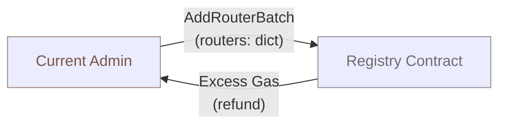
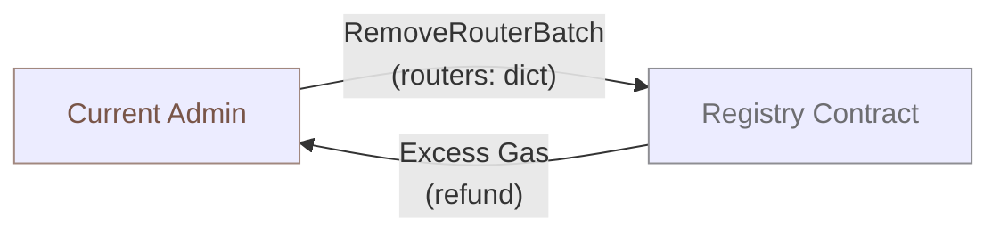
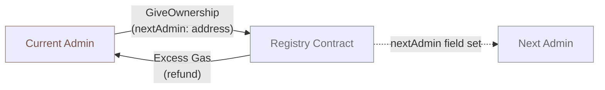
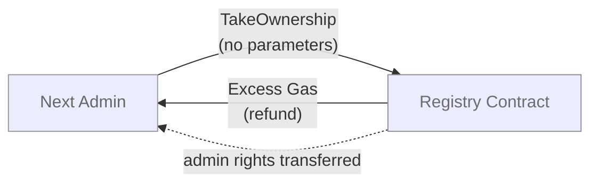

# Registry Contract Architecture

## Overview

The Registry contract is a decentralized router management system that maintains a registry of validated routers with their metadata. It serves as a trusted source for ston.fi router validation in a decentralized way.

## Purpose

- **Router Registry**: Maintains a curated list of approved routers with version and type information
- **Router Validation**: Provides public validation service for router legitimacy
- **Access Control**: Implements admin-based governance for router management
- **Ownership Transfer**: Supports secure admin ownership transitions

## Contract Storage

```tolk
struct RegistryStorage {
    admin: address;         // Current admin address
    nextAdmin: address;     // Pending admin address for ownership transfer
    routers: dict;          // Dictionary mapping router addresses to RouterDescription
}

struct RouterVersion {
    version_major: uint8;           // Major version number (0-255)
    version_minor: uint8;           // Minor version number (0-255)
    version_development: bits256;   // Development version text (32 bytes UTF-8)
}

struct RouterDescription {
    router_type: uint32;    // Router type identifier
    router_id: uint64;        // Router ID
    version: RouterVersion;   // Router version information
}
```

## Public Methods

### Get Methods

- **`getRegistryData()`**: Returns complete registry state including admin addresses and router dictionary

### Message Handlers

#### Public Messages

- **`ValidateRouter`**: Validates if a router exists in registry and returns router details
    - **Sender**: Any address
    - **Response**: `RouterValidatedMessage` to specified response address



- **`GetAllRouters`**: Retrieves the entire router dictionary from the registry
    - **Sender**: Any address
    - **Response**: `AllRoutersMessage` with complete router dictionary to specified response address



#### Admin Messages

- **`AddRouter`**: Adds a single router to the registry
    - **Sender**: Current admin only
    - **Parameters**: Router address and description (version, type)



- **`RemoveRouter`**: Removes a router from the registry
    - **Sender**: Current admin only
    - **Parameters**: Router address



- **`AddRouterBatch`**: Adds multiple routers in one transaction
    - **Sender**: Current admin only
    - **Parameters**: Dictionary of routers with descriptions



- **`RemoveRouterBatch`**: Removes multiple routers in one transaction
    - **Sender**: Current admin only
    - **Parameters**: Dictionary of router addresses



- **`GiveOwnership`**: Initiates admin ownership transfer
    - **Sender**: Current admin only
    - **Parameters**: Next admin address
    - **Effect**: Sets nextAdmin, requires confirmation via TakeOwnership



#### NextAdmin Messages

- **`TakeOwnership`**: Completes admin ownership transfer
    - **Sender**: nextAdmin only
    - **Effect**: Transfers admin rights and clears nextAdmin



## Access Control

### Permission Levels

1. **Public**: Anyone can validate routers
2. **Admin**: Can manage routers and initiate ownership transfer
3. **NextAdmin**: Can complete ownership transfer

### Security Features

- Router addresses restricted to workchain 0
- Admin verification on all management operations
- Two-step ownership transfer process
- Atomic batch operations for multiple routers

## Error Handling

- `ERROR_NOT_ADMIN`: Non-admin attempts admin operation
- `ERROR_NOT_NEXT_ADMIN`: Invalid take ownership attempt
- `ERROR_ROUTER_NOT_FOUND`: Router validation fails
- `ERROR_INVALID_WORKCHAIN`: Router not in workchain 0

## Integration Points

### Incoming Messages

- **External users**: Router validation requests
- **Admin**: Router management and ownership operations
- **NextAdmin**: Ownership acceptance

### Outgoing Messages

- **Validation responses**: Sent to specified response addresses
- **Excess messages**: Gas refunds to message senders

## Diagram Legend

- **Blue-Grey**: Any User (public access)
- **Brown**: Current Admin (privileged access)
- **Grey**: Next Admin (pending admin)
- **Grey**: Registry Contract
- **Light Grey**: Response Address
